# [fit] Where the linear lambdas go

## by Wen Kokke

---


### Me, reading *"Session Types without Tiers"* by *Fowler et al.*

---

$$
\begin{array}{l}
\mathbf{let} \; s = \mathbf{fork}(\lambda (s : \; !\mathbf{1}.\text{End}).\\
\qquad \mathbf{let} \; s = \mathbf{send}((), s)\\
\qquad \mathbf{close}(s)\\
)\\
\mathbf{let} \; ((), s) = \mathbf{recv}(s)\\
\mathbf{close}(s)\\
\end{array}
$$

---


### Me, implementing *"Session Types without Tiers"* in *Rust*.

---


``` rust


        let s = fork!(move |s: Send<(), End>| {
            let s = send((), s)?;
            close(s)
        });
        let ((), s) = recv(s)?;
        close(s)


```

---


## They look the same.

## Do they do the same?

---

``` rust
#[test]
fn ping_works() {
    assert!(|| -> Result<(), Box<Error>> {

        let s = fork!(move |s: Send<(), End>| {
            let s = send((), s)?;
            close(s)
        });
        let ((), s) = recv(s)?;
        close(s)

    }().is_ok()); // it actually is!
}
```

---


## Well that sounds ok.

## Maybe we prove?

---


## There's formal semantics for Rust, right?

---


# [fit] No. Not really.

---

# [fit] Let's try QuickCheck?

---


# [fit] No, not that one.

---

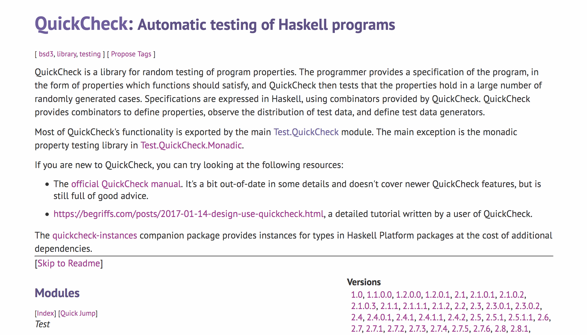

# [fit] Yes, thank you.

---

# My good plan:

1. make some lambdas
2. eval them lambdas
3. translate them to rust
4. eval them rust
5. see if they same

---

# QuickCheck, please make some lambdas?

> "There is no generic arbitrary implementation included because we don't know how to make a high-quality one. If you want one, consider using the `testing-feat` or `generic-random` packages."
-- xoxo QuickCheck

---

# Fine, I'll write one!

``` haskell
type Name
    = String

data Term
    = Var Name
    | Lam Name Term
    | App Term Term

instance Arbitrary Term where
    arbitrary = oneof
        [ Var <$> arbitrary
        , Lam <$> arbitrary <*> arbitrary
        , App <$> aribtrary <*> arbitrary
        ]
```

---

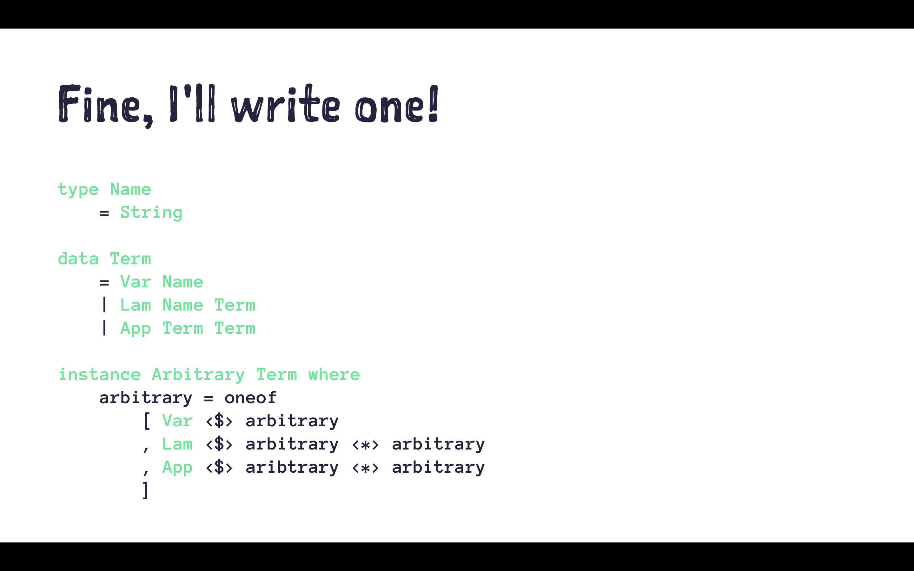

## `Lam ">h" (Var "\EOT\NAKW")`

# Oh.

---

# Eugh, I guess I'll do some thinking

``` haskell
data Z        -- Z has no elements

data S n      -- S n has |n| + 1 elements
    = FZ      -- e.g. TwoOfFour :: S (S (S (S Z)))
    | FS n    --      TwoOfFour = FS (FS FZ)

data Term n                    -- every term is
    = Var n                    -- well-scoped
    | Lam (Term (S n))         -- so no more
    | App (Term n) (Term n)    -- nonsense
```

---

# How do I random these?

``` haskell
instance Arbitrary Z where
    arbitrary = oneof [] -- a lie

instance Arbitrary n => Arbitrary (S n) where
    arbitrary = oneof [ pure FZ , FS <$> arbitrary ]

instance Arbitrary n => Arbitrary (Term n) where
    arbitrary = oneof
        [ Var <$> arbitrary
        , Lam <$> arbitrary
        , App <$> aribtrary <*> arbitrary
        ]
```

---

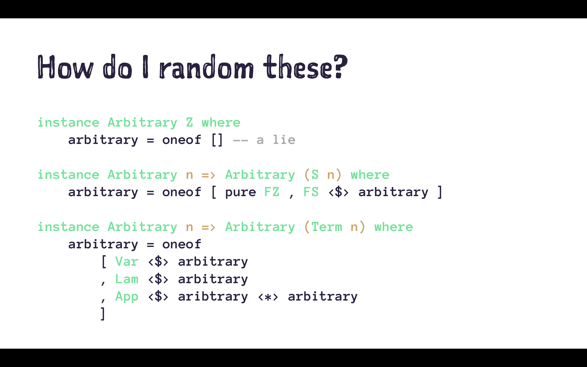

## `Lam (Lam (Var (FS FZ)))`

# Yay!

---

# [fit] But types?

---

# Cool, let's add some types...

``` haskell
data Type
    = Void
    | Type :-> Type

data Term n
    = Var n
    | Lam (Term (S n))
    | App (Term n) (Term n) Type -- this is new!

check :: [Type] -> Type -> Term n -> Bool
check env a         (Var n)     = lookup env n == a
check env (a :-> b) (Lam t)     = check (a : env) b t
check env b         (App f s a) = check env (a :-> b) f && check env a s
check _   _         _           = False
```

---

# Only the well-typed ones plz?

``` haskell
instance Arbitrary Type where
    arbitrary = oneof 
        [ pure Void 
        , (:->) <$> arbitrary <*> arbitrary 
        ]
        
newtype WellTyped n = WellTyped (Term n)

instance Arbitrary WellTyped Z where
    arbitrary = do
        a <- arbitrary -- an arbitrary type
        t <- arbitrary -- an arbitrary ~closed~ term
        if check [] t a then WellTyped t else arbitrary
```

---

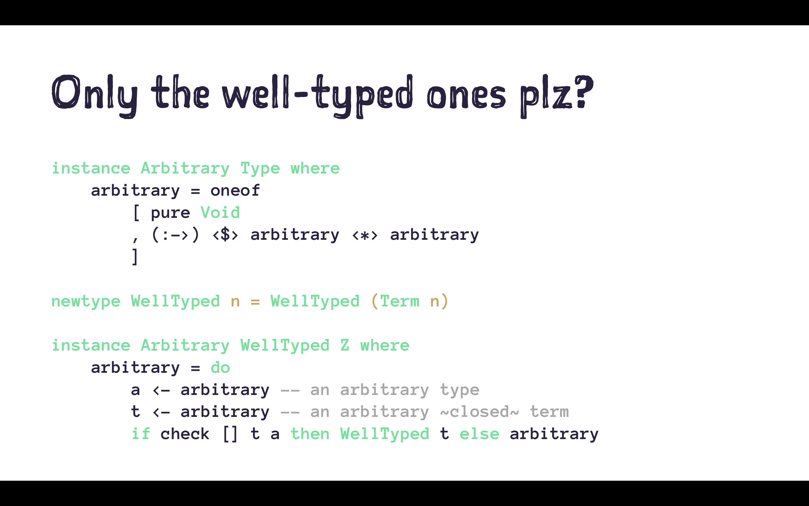

## `...`

# Uh?

---


## `...`

# What's going on?

---


## `...`

# Why is nothing happening?

---


# [fit] Halp?!

---

# [fit] Eugh, I guess I'll do some research

---

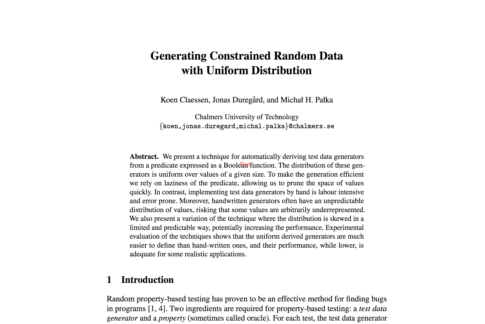

# Koen Claessen.
# No surprise there...

---

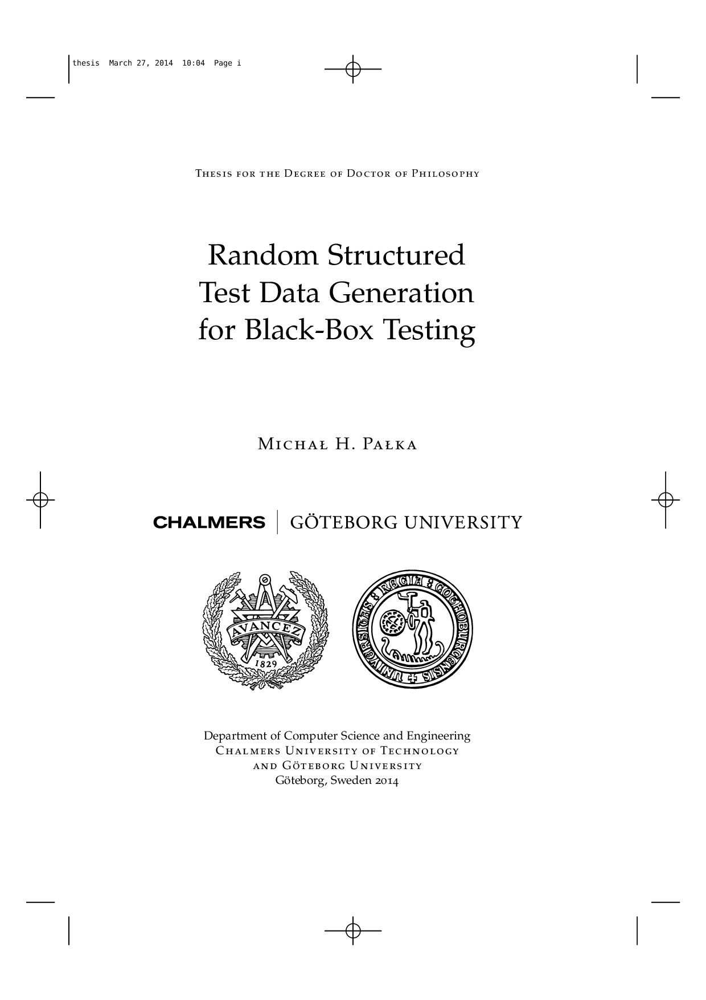
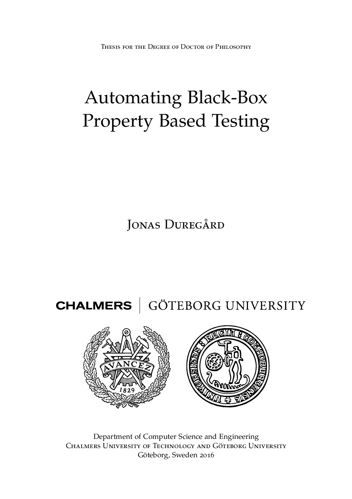

# ...
# And two of his students...

---

# So what is their trick?

---

# Bag of tricks

1. do some really gross stuff to ensure sharing
   (implemented in the `size-based` package)
2. do some DSL magic to enumerate data types
   (implemented in the `testing-feat` package)
3. do some gross stuff to filter ill-typed terms eagerly
   (implemented in the `lazy-search` package)

---

# [fit] Really gross stuff 
# [fit] to ensure sharing

## (Hint: it's encapsulated global state)

---

# [fit] DSL magic to enumerate data types

``` haskell
instance Enumerable Z where
    enumerate = datatype [] -- no longer a lie

instance Enumerable n => Enumerable (S n) where
    enumerate = datatype [ v0 FZ , v1 FS ]

instance Enumerable Type where
    enumerate = datatype [ v0 Void , v2 (:->) ]

instance Enumerable n => Enumerable (Term n) where
    enumerate = datatype [ pay (v1 Var) , pay (v1 Lam) , pay (v3 App) ]
```

---

# [fit] Does it work out of the box?

``` haskell
-- get me the lambdas of size <30
$ eleanor --system Untyped --action Print --size 30
[Lam (Var FZ), Lam (Lam (Var FZ)), Lam (Lam (Var (FS (FZ)))), ...]

-- how many lambdas of size <30?
$ eleanor --system Untyped --action Count --size 30
7964948391145

-- how many lambdas of size <100?
$ eleanor --system Untyped --action Count --size 100
4503787720194931500936021688288566428450647198899831131920
```

---

# [fit] Does it work out of the box?

``` haskell
-- how many lambdas of size <1000?
$ eleanor --system Untyped --size 1000 
308979047539797286389554754656050850905240507708427967498701817852887971931069975365901
857378119631500575402859069294978611884417142648912870521418834178736010885629562442174
695729552893817244891920582785029398882622008238200608644806387090253102487903461107900
446985363433164099802667368836306482954336643903824771835185388183129889962918463489147
669085392503510337274432408608493215807279736697555590998870222330656848190305130272295
748823658429313198623977474018608312268715019965824283441864212858719037406270777784320
128035445486523339972120044617149804509803809721945756672127484790222562203093028297330
701810553080361603375463934103265024019533365037819232420615636268119286995638542364078
581194561105664479452966258068391627683565675385447131617537498143916191855677543179164
38424355480696688647214814359468956803017461383159776132586

real  1m 26.740s
user  1m 23.087s
sys   0m  1.216s
```

---

# [fit] Gross stuff to filter ill-typed lamdas eagerly

``` haskell
univ :: (a -> Bool) -> (b -> a) -> Maybe Bool
univ pred val = unsafePerformIO $ 
    Just (pred (val undefined)) `catch` \err -> Nothing
    
-- will this lambda work out?
> univ (check [] Void) (\hole -> Lam hole)
Just False -- no

-- will this lambda work out?
> univ (check [] (Void :-> Void)) (\hole -> Lam hole)
Nothing -- dunno?
```

---

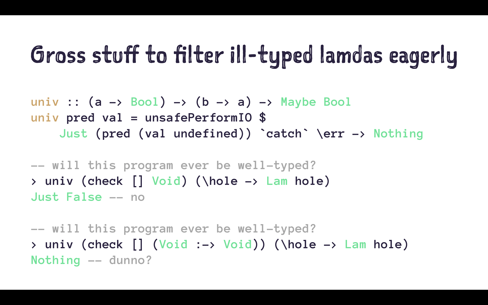

# [fit] Only works if your
# [fit] predicate is eager!

---

# [fit] Does it work out of the box?

``` haskell
-- get me the lambdas of type Void :-> Void and size <30!
$ eleanor --system SimplyTyped --action Print --size 30
[Lam (Var FZ), Lam (App (Lam (Var FZ)) (Var FZ) Void), ...]

-- how many lambdas of type Void :-> Void and size <30?
$ eleanor --system SimplyTyped --action Count --size 30
11369362

real  6m 31.701s  -- does not look as good
user  6m 25.991s  -- slower by a magnitude
sys   0m  3.950s  -- but better than anything I've written
```

---


# [fit] Problem solved!

---

# [fit] I made a lie :sob:

---

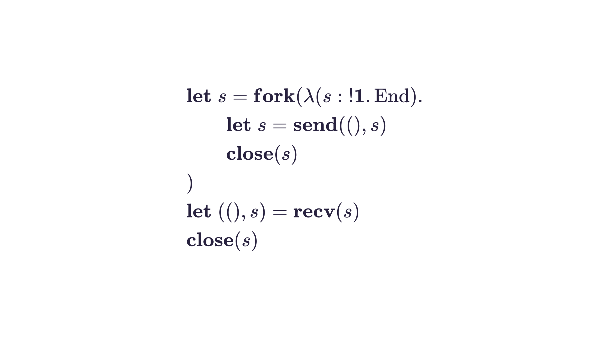

# This is linear

---

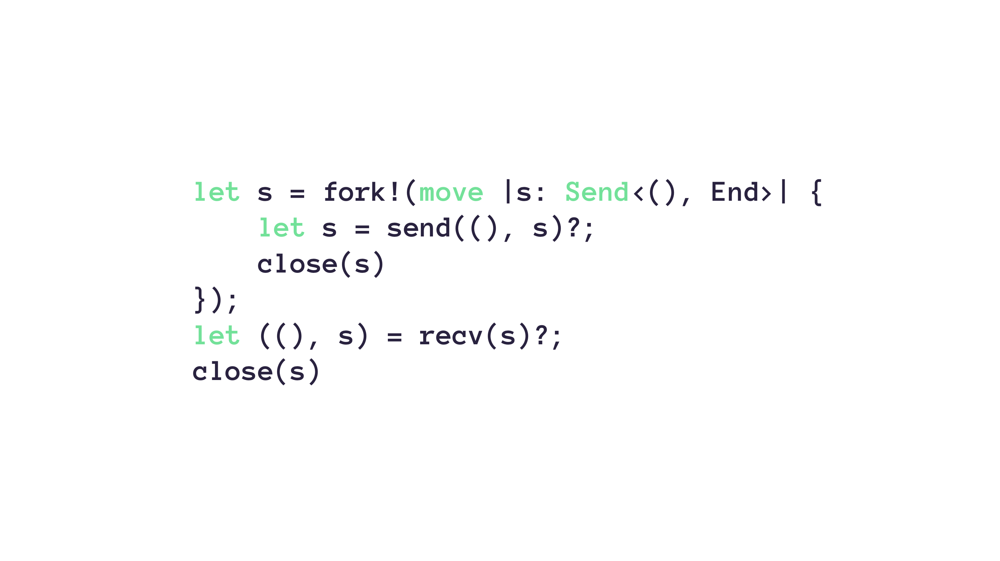

# This is affine

---

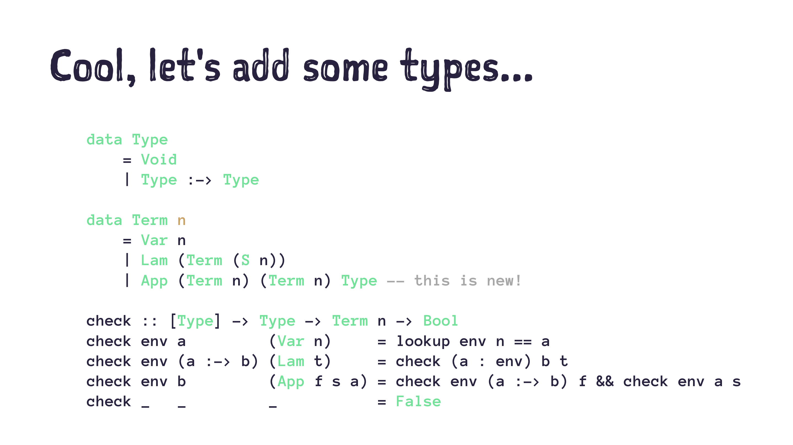

# This is neither

---

# [fit] I sorry :sob:

---

# [fit] More research?

---

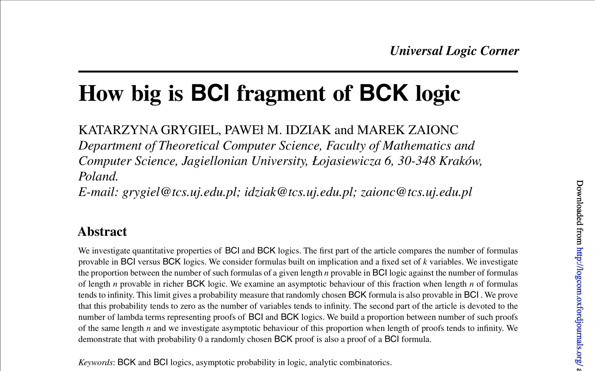

# How many affine lambdas are linear?

---

# How many affine lambdas are linear?

> "Theorem 42.
> The density of BCI terms among BCK terms equals 0."
-- xoxo Grygiel, Idiziak, and Zaionc

# [fit] :scream_cat:

---

# [fit] Ok sad :sob:

## Means effectively no lambdas are linear

---

# What can we do?

> "Sometimes you just have to be stupid and try to search an immensely huge search space just 'cuz you can."
-- xoxo some A.I. researcher (probably)

---

# What can we do? Check linearity?
   
1. try every possible split of the `env` at every `App`
   (so each variable *can* only be used once)
   
   :x: uh, that sounds expensive?

---

# I tried, it was

``` haskell
check :: Fin n => [(n, Type)] -> Type -> Term n -> Bool
check env a         (Var x)     = env == [(x, a)]
check env (a :-> b) (Lam t)     = check ((FZ, a) : map (first FS) env) b t
check env b         (App f s a) = or
    [ check env1 (a :-> b) f && check env2 a s 
    | n <- [0..length env] , (env1, env2) <- combinations n env ]
check _   _         _           = False

combinations :: Int -> [a] -> [([a], [a])]
combinations 0 xs = [([], xs)]
combinations n (x:xs) =
    [ (x:xs, ys) | (xs, ys) <- combinations (n - 1) xs ] ++
    [ (xs, x:ys) | (xs, ys) <- combinations (n - 1) xs ]

-- how many linear lambdas of type Void :-> Void and size <30?
$ eleanor --system Linear --strategy Stupid --action Count --size 30
9790 -- took like a few hours
```

---

# What can we do? Check linearity?

   
1. try every possible split of the `env` at every `App`
   (so each variable *can* only be used once)
   
   :x: uh, that sounds expensive?

2. change the type of `env` to `Map n Type`
   (so you can track whether stuff has been used)
   
   :x: isn't parallelizable or eager!

---

# I tried

``` haskell
check :: Fin => Type -> Term n -> State (Map n Type) Bool
check a (Var x) = do 
    env <- get                            -- ...
    modify (delete x)                     -- remove variable
    return $ lookup FZ env == Just a      -- was the type right?
check (a :-> b) (Lam t) = do 
    modify (insert FS a . mapKeys FS)     -- insert new variable
    cond1 <- check a t                    -- check body
    env   <- get                          -- ...
    let cond2 = lookup FZ env == Nothing  -- was new variable used?
    modify (mapKeys pred)                 -- restore old variables
    return $ cond1 && cond2
check b (App f s a) = do 
    cond1 <- check (a :-> b) f            -- check function
    cond2 <- check a s                    -- check argument
    return $ cond1 && cond2
check _ _ = do return False
```
---

# I tried, it's not bad, actually

``` haskell
-- how many linear lambdas of type Void :-> Void and size <30?
$ eleanor --system Linear --action Count --size 30
9790

real  0m  2.580s
user  0m  2.361s
sys	  0m  0.264s
```

---

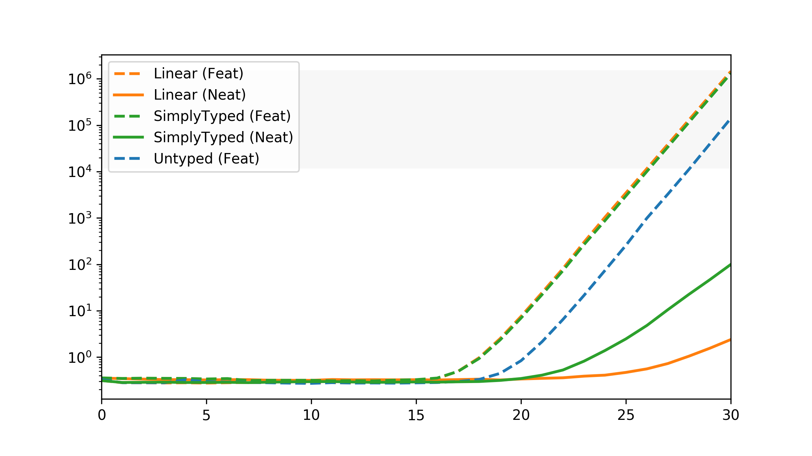

---

# Future work

Can we make some BCI terms and translate them?

+ it's way easier, but not complete :confused:
+ e.g. we don't get $$\lambda x.(\lambda y.y) \; x$$
+ is that a problem?

---

# Future work

Can we use the structure of linear lambdas to prune our search space?

+ each term has $$n$$ lambas, $$n$$ vars, and $$n - 1$$ apps
+ kinda hard, probably won't scale well

---

# Current work

Oh, right, I was testing a Rust library!

Let's see if that works now...

---

# [fit] Oh no!
# [fit] I'm out of time!

---

# What have we seen?

1. generating random lambdas is hard
2. there are some cool libraries out there to help you
3. ~~most tooling doesn't work for linear lambdas~~
4. ~~everything sucks~~
