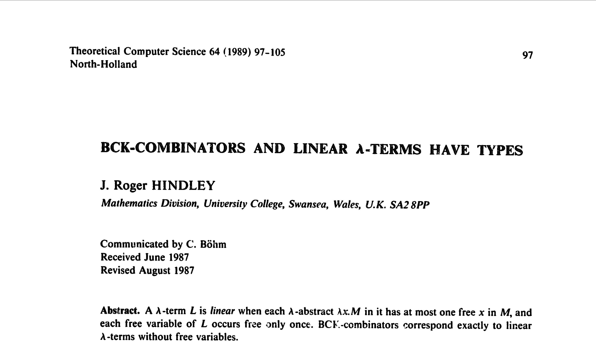

# [fit] Where the linear lambdas go

## by Wen Kokke

---


### Me, reading *"Session Types without Tiers"* by *Fowler et al.*

---

$$
\begin{array}{l}
\mathbf{let} \; s = \mathbf{fork}(\lambda (s : \; !\mathbf{1}.\text{End}).\\
\qquad \mathbf{let} \; s = \mathbf{send}((), s)\\
\qquad \mathbf{close}(s)\\
)\\
\mathbf{let} \; ((), s) = \mathbf{recv}(s)\\
\mathbf{close}(s)\\
\end{array}
$$

---


### Me, implementing *"Session Types without Tiers"* in *Rust*.

---


``` rust


        let s = fork!(move |s: Send<(), End>| {
            let s = send((), s)?;
            close(s)
        });
        let ((), s) = recv(s)?;
        close(s)


```

---


## They look the same.

## Do they do the same?

---

``` rust
#[test]
fn ping_works() {
    assert!(|| -> Result<(), Box<Error>> {

        let s = fork!(move |s: Send<(), End>| {
            let s = send((), s)?;
            close(s)
        });
        let ((), s) = recv(s)?;
        close(s)

    }().is_ok()); // it actually is!
}
```

---


## Well that sounds ok.

## Maybe we prove?

---


## There's formal semantics for Rust, right?

---


# [fit] No. Not really.

---

# [fit] Let's try QuickCheck?

---


# [fit] No, not that one.

---


# [fit] Yes, thank you.

---

# My good plan:

1. make some lambdas
2. eval them lambdas
3. translate them to rust
4. eval them rust
5. see if they same

---

# QuickCheck, please make some lambdas?

> "There is no generic arbitrary implementation included because we don't know how to make a high-quality one. If you want one, consider using the `testing-feat` or `generic-random` packages."
-- xoxo QuickCheck

---

# Fine, I'll write one!

``` haskell
    type Name
        = String

    data Term
        = Var Name
        | Lam Name Term
        | App Term Term

    instance Arbitrary Term where
        arbitrary = oneof
            [ Var <$> arbitrary
            , Lam <$> arbitrary <*> arbitrary
            , App <$> aribtrary <*> arbitrary
            ]
```

---


## `Lam ">h" (Var "\EOT\NAKW")`

# Oh.

---

# Eugh, I guess I'll do some thinking

``` haskell
    data Z        -- Z has no elements

    data S n      -- S n has |n| + 1 elements
        = FZ      -- e.g. TwoOfFour :: S (S (S Z))
        | FS n    --      TwoOfFour = FS FZ

    data Term n                    -- every Term is
        = Var n                    -- well-scoped
        | Lam (Term (S n))         -- so no more
        | App (Term n) (Term n)    -- nonsense
```

---

# How do I random these?

``` haskell
    instance Arbitrary Z where
        arbitrary = oneof [] -- a lie

    instance Arbitrary n => Arbitrary (S n) where
        arbitrary = oneof [ pure FZ , FS <$> arbitrary ]

    instance Arbitrary n => Arbitrary (Term n) where
        arbitrary = oneof
            [ Var <$> arbitrary
            , Lam <$> arbitrary
            , App <$> aribtrary <*> arbitrary
            ]
```

---


## `Lam (Lam (Var (FS FZ)))`

# Yay!

---

# [fit] But types?

---

# Cool, let's add some types...

``` haskell
    data Type
        = Void
        | Type :-> Type
    
    data Term n
        = Var n
        | Lam (Term (S n))
        | App (Term n) (Term n) Type -- this is new!

    check :: [Type] -> Type -> Term n -> Bool
    check env a         (Var n)     = lookup env n == a
    check env (a :-> b) (Lam t)     = check (a : env) b t
    check env b         (App f s a) = check env (a :-> b) f && check env a s
    check _   _         _           = False
```

---

# Only the well-typed ones plz?

``` haskell
    instance Arbitrary Type where
        arbitrary = oneof 
            [ pure Void 
            , (:->) <$> arbitrary <*> arbitrary 
            ]
            
    newtype WellTyped n = WellTyped (Term n)
    
    instance Arbitrary WellTyped Z where
        arbitrary = do
            a <- arbitrary -- an arbitrary type
            t <- arbitrary -- an arbitrary ~closed~ term
            if check [] t a then WellTyped t else arbitrary
```

---


## `...`

# Uh?

---


## `...`

# What's going on?

---


## `...`

# Why is nothing happening?

---


# [fit] Halp?!

---

# [fit] Eugh, I guess I'll do some research

---


# [fit] Koen Claessen
# Right, no surprises here...

---


# And two of his students...

---

# So what is their trick?

---

# Bag of tricks

1. do some really gross stuff to ensure sharing
   (implemented in the `size-based` package)
2. do some DSL magic to enumerate data types
   (implemented in the `testing-feat` package)
3. do some gross stuff to filter ill-typed terms eagerly
   (implemented in the `lazy-search` package)

---

# [fit] Really gross stuff 
# [fit] to ensure sharing

## (Hint: it's encapsulated global state)

---

# [fit] DSL magic to enumerate data types

``` haskell
    instance Enumerable Z where
        enumerate = datatype [] -- no longer a lie

    instance Enumerable n => Enumerable (S n) where
        enumerate = datatype [ v0 FZ , v1 FS ]

    instance Enumerable Type where
        enumerate = datatype [ v0 Void , v2 (:->) ]

    instance Enumerable n => Enumerable (Term n) where
        enumerate = datatype [ pay (v1 Var) , pay (v1 Lam) , pay (v3 App) ]
```

---

# [fit] Does it work out of the box?

``` haskell
    -- get me the lambdas of size 3!
    $ snd (valuesWith global !! 3)
    > [ Lam (Lam (Var FZ)) , Lam (Lam (Var (FS (FZ)))) ]
    
    -- how many lambdas of size <30?
    $ sum (map fst (take 30 (valuesWith global)))
    > 7964948391145
    
    -- how many lambdas of size <100?
    $ sum (map fst (take 100 (valuesWith global)))
    > 4503787720194931500936021688288566428450647198899831131920
```

---

# [fit] Gross stuff to filter ill-typed lamdas eagerly

``` haskell
    test :: (a -> Bool) -> (b -> a) -> Maybe Bool
    test pred val = unsafePerformIO $ 
        Just (pred (val undefined)) `catch` \err -> Nothing
        
    -- will this lambda work out?
    $ test (check [] Void) (\hole -> Lam hole)
    > Just False -- no
   
    -- will this lambda work out?
    $ test (check [] (Void :-> Void)) (\hole -> Lam hole)
    > Nothing -- dunno
```

---


# [fit] Only works if your
# [fit] predicate is eager!

---

# [fit] Does it work out of the box?

``` haskell
    -- get me the lambdas of type Void :-> Void and size <30!
    $ search 30 (check [] (Void :-> Void))
    > [ Lam (Var FZ) , Lam (App (Lam (Var FZ)) (Var FZ) Void) , ... ]
    
    -- how many lambdas of type Void :-> Void and size <30?
    $ length =<< search 30 (check [] (Void :-> Void))
    > 11369362 -- took like a minute
```

---


# [fit] Problem solved!

---

# [fit] I made a lie :sob:

---


# This is linear

---


# This is affine

---


# This is neither

---

# [fit] I sorry :sob:

---

# What can we do?

1. change the type of `env` to `[(Bool, Type)]`
   (so you can track whether stuff has been used)
   
   :x: isn't parallelizable any more!
   
2. try every possible split of the `env` at every `App`
   (so the variables *can* only be used once)
   
   :x: uh, that sounds expensive?

---

# I tried, it was

``` haskell
checkLinear :: Fin n => [(n, Type)] -> Type -> Term n -> Bool
checkLinear env a         (Var x)     = env == [(x, a)]
checkLinear env (a :-> b) (Lam t)     = checkLinear ((FZ, a) : map (first FS) env) b t
checkLinear env b         (App f s a) = or
    [ checkLinear env1 (a :-> b) f && checkLinear env2 a s 
    | n <- [0..length env] , (env1, env2) <- combinations n env ]
checkLinear _   _         _           = False

combinations :: Int -> [a] -> [([a], [a])]
combinations 0 xs = [([], xs)]
combinations n (x:xs) =
    [ (x:xs, ys) | (xs, ys) <- combinations (n - 1) xs ] ++
    [ (xs, x:ys) | (xs, ys) <- combinations (n - 1) xs ]

-- how many linear lambdas of type Void :-> Void and size <30?
$ length =<< search 30 (checkLinear [] (Void :-> Void))
> 9790 -- took like a few hours
```

---

# [fit] More research?

---


# How many affine lambdas are linear?

---

# How many affine lambdas are linear?

> "Theorem 42.
> The density of BCI terms among BCK terms equals 0."
-- xoxo Grygiel, Idiziak, and Zaionc

# [fit] :scream_cat:

---

# [fit] Ok sad :sob:

## Means effectively no lambdas are linear

---

# [fit] Good news too?

---

# [fit] Yes.



---


---

# [fit] Every linear lambda
# [fit] has a type.


---

# My great plan:

1. make linear lambdas
2. give them type
3. rest of my good plan

---

# How to make linear lambdas?

1. make some BCIs and translate them
   (is easy, but not complete :confused:)
   (e.g. we don't get $$\lambda x.(\lambda y.y) \; x$$)
2. use the structure of linear lambdas
   (each term has $$n$$ lambdas, $$n$$ vars, and $$n - 1$$ apps)
   (is hard, and may not scale well)

---

# [fit] Abrupt ending.

---

# What have we seen?

1. generating random lambdas is hard
2. there are some cool libraries out there to help you
3. none of the tooling works for linear lambdas
4. everything sucks
